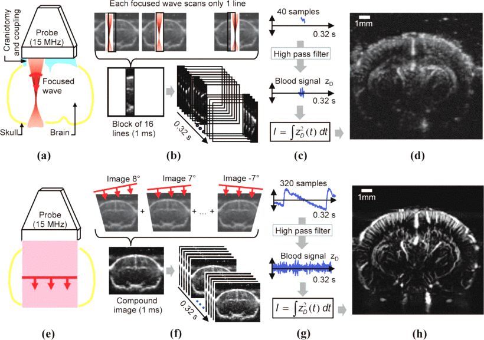
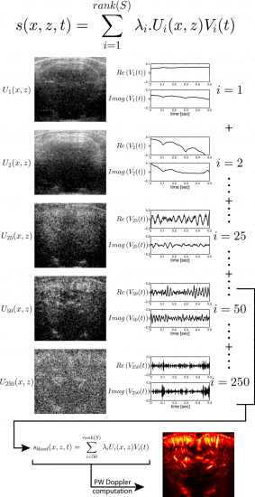

# Acquisition of Power Doppler Signal

Doppler imaging is based on using ultrasonic pulses to measure the displacement of blood in the brain. fUSI relies on the improvement of this technique to increase sensitivity thanks to the use of a different sequence of ultrasound pulses. This new sequence derives for ultrafast imaging and consists of emitting ultrasonic plane waves (instead of focused) at a very high frame rate (~20kHz). 

For each plane wave, we measure the backscattered echoes coming from every point of the image and store them into computer memory. A full ultrasonic image is reconstructed from a single emission using **parallel beamforming**. This image was acquired very fast (one emission) but has low quality. To regain quality, **coherent compounding** is done. This is done by combining the backscattered echoes of a set of n plane wave emissions titled with different angles (usually $n=10-16$, between -7 and +8° by steps of 1°). 

///caption
Figure from Mace et al, 2013[^1] showing the comparison between conventional (a-d) and ultrafast (e-h) doppler imaging.
///

After this step, we obtain a complex signal sampled at typically 0.5-1kHz. The value of 1kHz is needed to respect the Nyquist theorem and avoid aliasing. Indeed,  $f_D < f_s /2$  and $f_D = 2f_uV_y/c$ = ~ 500Hz with $f_u = 15MHz$ and $Vy = 0.5-25mm/s$.

From this complex signal, typically some form of filtering is applied to remove tissue motion. Because this tissue motion is slow and global, the most common method is to use a spatiotemporal clutter filter[^2]. The idea is to run singular value decomposition of the signal and remove the first components, which should capture tissue motion. The exact parameters of this process can be somewhat arbitrary and typically depend on preparation. The main things to choose are:

- window over which to compute the SVD (typically a few hundred ms?)
- number of components to remove (10-100). The upper bound is defined by the number of samples in the chosen window.

///caption
Figure from Demene et al. 2015[^2] illustrating the spatiotemporal clutter filtering.
///

A method has been proposed to automatically adapt the number of components to remove[^3].
Another method is to simply high-pass filter the signal, but it is thought to be less good.

Power doppler is then computed by taking the mean intensity of the Doppler signal at each voxel (mean of the square of modulus of the complex filtered signal across time). Note that here we can also extract blood velocity (though this measure is more noise-sensitive).

At this point we can decide the sampling rate we want for the power doppler. It is a trade-off: a higher sampling rate will give a better temporal resolution and possibility to look at finer dynamics, but lower SNR. Typically sampling rates between 1 and 5Hz are used. One thing to keep in mind is that changes in blood volume are slow, so this will be the main limit of the temporal resolution of the method. However, lags of 10’s of ms between different voxels can be meaningful.

The Power doppler signal in each voxel should be proportional to the number of red blood cells, i.e. to the **blood volume**.

[^1]: E. Mace, G. Montaldo, B. -F. Osmanski, I. Cohen, M. Fink and M. Tanter, "Functional ultrasound imaging of the brain: theory and basic principles," in *IEEE Transactions on Ultrasonics, Ferroelectrics, and Frequency Control*, vol. 60, no. 3, pp. 492-506, March 2013, doi: [10.1109/TUFFC.2013.2592](http://dx.doi.org/10.1109/TUFFC.2013.2592).
[^2]: Demené C, Deffieux T, Pernot M, Osmanski BF, Biran V, Gennisson JL, Sieu LA, Bergel A, Franqui S, Correas JM, Cohen I, Baud O, Tanter M. Spatiotemporal Clutter Filtering of Ultrafast Ultrasound Data Highly Increases Doppler and fUltrasound Sensitivity. IEEE Trans Med Imaging. 2015 Nov;34(11):2271-85. doi: [10.1109/TMI.2015.2428634](http://dx.doi.org/10.1109/TMI.2015.2428634).
[^3]: Baranger J, Arnal B, Perren F, Baud O, Tanter M, Demene C. Adaptive Spatiotemporal SVD Clutter Filtering for Ultrafast Doppler Imaging Using Similarity of Spatial Singular Vectors. IEEE Trans Med Imaging. 2018 Jul;37(7):1574-1586. doi: [10.1109/TMI.2018.2789499](https://doi.org/10.1109/tmi.2018.2789499). PMID: 29969408.
