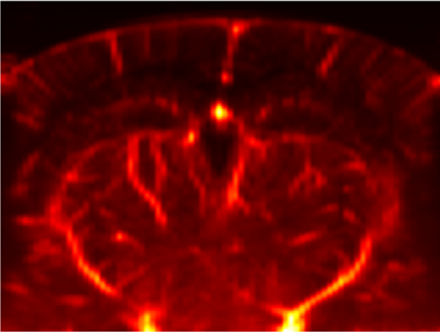
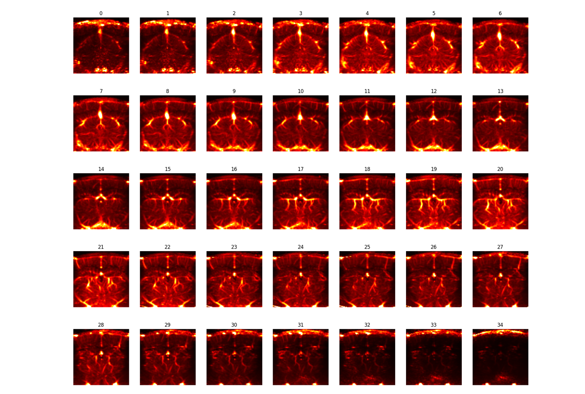
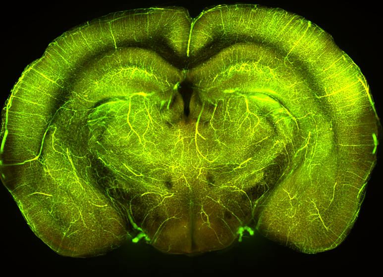
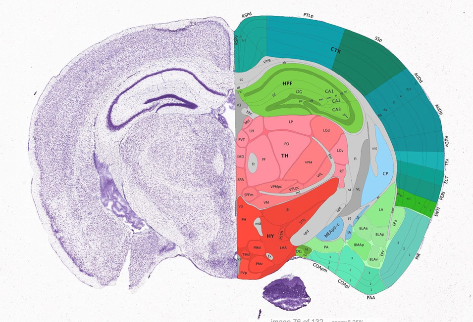
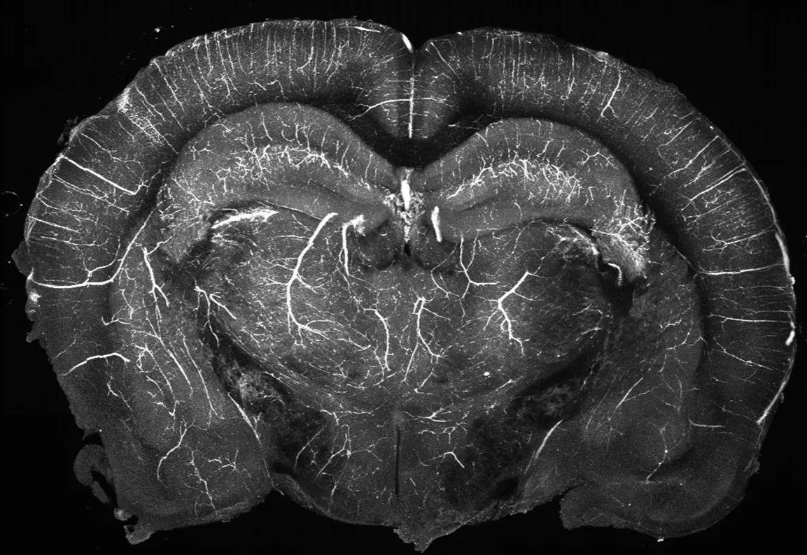
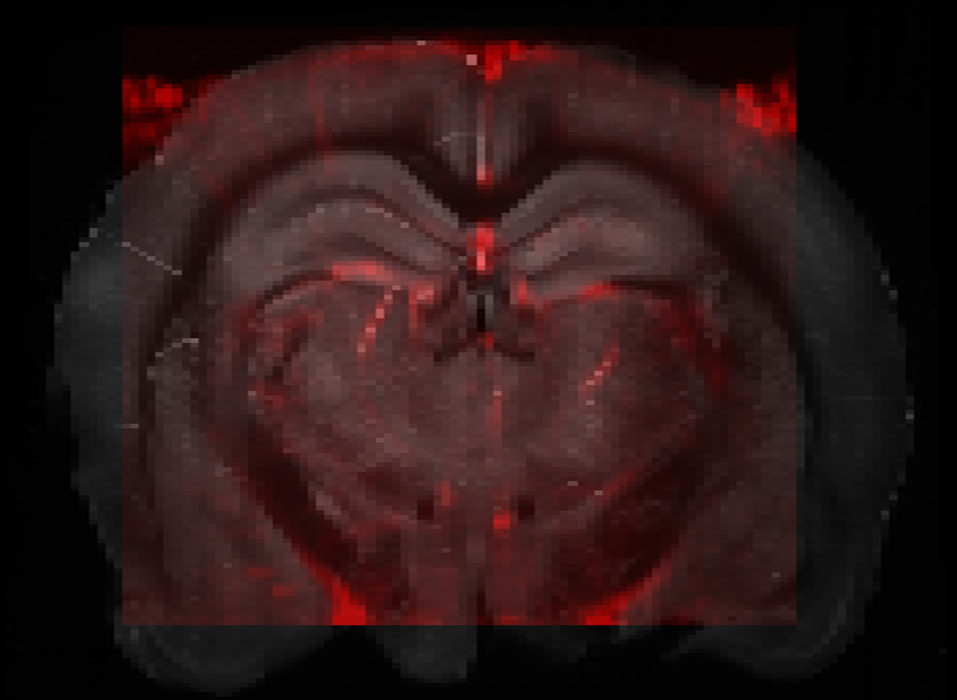

# Anatomical Registration

Typically we obtain Power Doppler images and want to know where the signal we measure comes from in the brain. How we do this will highly depend on the **species** we are recording from. 

If the brain of the animal is small enough that we can image a full section of it in one plane (e.g. mice, rats), it is easier to identify the regions as more landmarks, such as boundaries between groups of regions, major arteries, overall borders of the brain, are available. 
If the field of view is restricted by a craniotomy and/or a bigger brain size, knowledge about the rough location of the image is needed. Cortical folds, if present, can be used as landmarks, though they can be quite variable across individuals. Functional mapping is often the best option to delineate functional regions (for eg in sensory cortices).  In some less common species, atlases might not be readily available. In which case this might be even more tricky. 

The rest of this section will focus on the **case of mice and rats**, in which whole-brain imaging is possible, images are roughly full sections of the brain and atlases are available.

All methods rely on establishing a mapping between voxels from fUS images and region labels (for e.g. from the Allen Reference Atlas). One can then morph the fUS signal into a ‘standard’, common brain, or assign a region label to each voxel, and average the signal within a given region. There exist many procedures and algorithms to perform this operation, we try to give you here an idea of what it means.

One common method is to use an average fUSI-based vascular map, obtained by aligning and averaging anatomical scans across many animals. This average is somehow aligned to the reference atlas (either manually, or automatically using intermediary data already registered, this only needs to be done once so can be quite fine-tuned). Each subject’s anatomical scan is then aligned to this average map. Each recorded slice is itself aligned to the anatomical scan.

Here we will consider the case of 2D coronal sections but the same principles apply to sagittal slices, or 3D recordings.

**[1]** A given recorded plane
*contains the data you want to align* 

**[2]** The animal’s anatomical scan (or vascular map)
*an overview of the field of view, obtained by sequential short acquisitions spaced a few 100um apart.*

**[3a]** an average vascular map 
OR 
**[3b]** the animal’s in vitro vascular map
*An intermediate vascular map that is or can be easily aligned to the reference atlas.*

**[4]** The reference atlas with region labels.
*For e.g the Allen reference atlas.*

We will describe the steps to go sequentially from step **[1]** to **[4]**

**[1] → [2]**
Here the idea is to align a given recording to the animal’s vascular map. This is not too hard as the baseline blood signal doesn’t change much across days. This can be achieved through cross-correlation of both images. The simplest (computationally) is to manually define the position of the section in the AP axis (i.e. which image of the scan should we match it to) and then do cross-correlation in z and x to find the best match. Alternatively, the cross-correlation can be done directly in 3D. At the other extreme, the alignment could be done fully manually.

**[2] → [3a]**

This step usually requires registration software to solve the alignment problem. For fUSI, one could use the typical tools of fMRI (namely, ANTs Registration, FSL FLIRT and FNIRT or AFNI 3dAllineate). Because the distribution of intensity in fUSI images is quite different than fMRI, these programs require a little tuning of their parameters to work properly. Alternatively, more powerful engines like ITK can be fine-tuned to fit the fUSI registration problem. This can also be done manually.

**[2] → [3b]**

Because the signals look quite different primarily due to differences in resolution, cross-correlation automated methods are unlikely to work. Instead, a semi-manual method can be used. 
First we need to do some smoothing or averaging in the off-plane axis (AP here) to account for the fact that fUS images pool blood signals from over 400um (while in-vitro slices are extremely sharp). At this point the in-vitro images start to look quite like the fUSI vascular map, only at a much higher resolution. One method to align these volumes is to manually define keypoints that are visible in both (for e.g, branching between blood vessels, big arteries, turning points, etc.). This gives a set of points that are matched in both volumes. Based on that, we can fit a transformation that will align these points. Affine transformations are easy to fit with a limited number of keypoints (~20 in each volume) and are usually quite good. Probably non-rigid could be done as well. A few iterations might be needed with visual confirmation of proper alignment.

**[3a] → [4]**

The idea of the average vascular map is that you only have to align it once to the reference atlas and then you rely on this mapping for all your animals. So you can put a lot of effort into making this alignment as good as possible, using non-rigid transformation and manual ajustements. This is typically already done and provided in commercial systems. Alternatively, there are some high-resolution vasculature maps already registered to the Allen atlas (for example, Todorov et al., 2020[^1]).

**[3b] → [4]**

In this version, you first need to perform blood vessel labelling on the animal you recorded from, which needs to be done as part of perfusion and standard histology.

This will provide you with a high-resolution vascular map, on top of standard autofluorescence. 
For mice and rats, this can be aligned very easily to atlases using existing toolboxes, such as [brainreg](https://brainglobe.info/documentation/brainreg/index.html).

///caption
Example section from blood vessel labelled brain, in vitro (projected in AP axis across 500um).
///

///caption
Resulting alignment of fUSi-based in vivo vascular map and in-vitro brain.
///

This alignment process can be used in two major ways:

- morph the fUSi acquisitions into a reference brain. This is typically done in functional connectivity studies, to visualize activation or patterns on a standard brain.
- get region labels for voxels (for e.g. to get average signal for different regions of interest). 
This point raises an additional challenge, which is to define what should be the size of regions of interest.

In any case, because a single voxel has a 100 * 100 * (400-800) μm, it can ‘contain’ multiple brain regions at the same time, given that atlases have segmented the brain into extremely precise regions. In addition, the alignment might not be perfect, so that the size of the regions should allow for a bit of jitter. Furthermore, the functional resolution might be less than defined by the size of the voxels. A region that would be contained in a single voxel is unlikely to be trusted with fUSI.

Ultimately, the choice of the regions of interest will depend on the specific question and its own requirements.

[^1]: Todorov, M.I., Paetzold, J.C., Schoppe, O. *et al.* Machine learning analysis of whole mouse brain vasculature. *Nat Methods* **17**, 442–449 (2020). [doi:10.1038/s41592-020-0792-1](https://doi.org/10.1038/s41592-020-0792-1).
