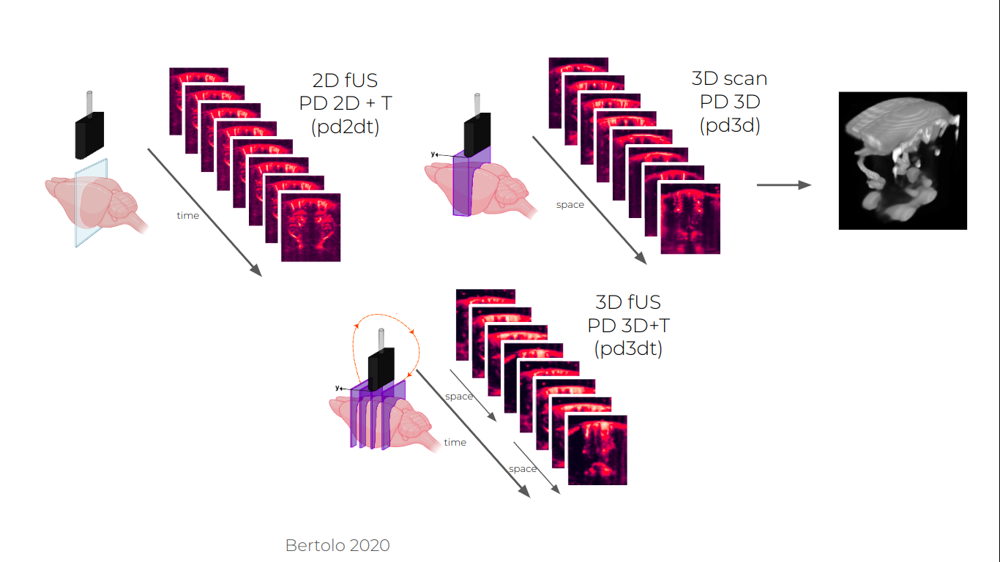
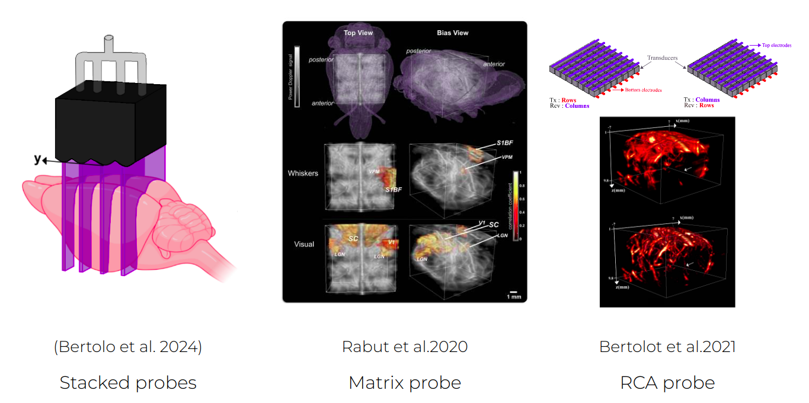

# Acquisition Systems

If you want to start acquiring data with fUSI, you will need:

1. An **ultrasound scanner** (usually produced by specialist manufacturers, such as
   [Verasonics](https://verasonics.com/), [us4us](https://us4us.eu/),
   [Iconeus](https://iconeus.com/), etc.).
2. A **computer** interfacing with it (usually containing powerful GPUs and fast SSDs to
   allow processing of the large data volumes needed for continuous acquisitions).
3. **Code to interface with the ultrasound scanner** and run the **specific fUSI**
   sequences (this is not something provided by default with ultrasound scanners)
4. An **ultrasound probe**.

Here we list a few options that we are aware of and recommend, but this is a
**non-exhaustive list**. Please feel free to reach out if you know other options that
you want to add here.

## Commercial Systems

### [**Iconeus One**](https://iconeus.com/iconeus-one/)

#### :lucide-thumbs-up: Pros

- Ready-to-use
- User-friendly interface, you won’t need to see any code
- Customer service: it probably won’t break, and if it does, it will be fixed

#### :lucide-thumbs-down: Cons

- Expensive
- Black-box: limited control over the sequence parameters or the acquisition pipeline
- Interfacing with other signals (video, other recording methods, behavior, etc.) might be less flexible and need some work
- Native output is Power Doppler and not IQs (see [Acquisition of Power Doppler signal](../data-processing/acquisition-power-doppler.md) to understand what that means)

## Open-Source Systems

### **EchoFrame**

An open-source code for fUSI acquisition to be released in 2026. Note that you will
still need to buy an ultrasound scanner, a GPU-equipped computer, as well as an
ultrasound probe. The total price of those depends on the specifications of the system,
ranging from ~75k€ for entry-level (64 channels, 2D) to ~200k€ for flagship (256
channels + 3D) systems. Information about purchasing those will be provided.

- [Poster presenting EchoFrame, SfN Oct. 2024](../assets/EchoFrame_Poster_Final.pdf)

#### :lucide-thumbs-up: Pros

- Cheaper
- Full control of the acquisition code: easy to play around with parameters of the sequence, or interface with custom acquisition codes
- Full access to raw data!

#### :lucide-thumbs-down: Cons

- Requires some level of familiarity with code and the way fUSi works
- No professional customer service by default. Might be some community help.
- Has not yet been tested at a large scale across multiple labs

## Probes

Here are various options of probes to consider for your acquisition system:

### Linear Probes

- **for 2D imaging**: The probe can be placed at a single location in the brain and image consecutively in time the same slice for different time stamps at a typical period ranging from 0.1 to 1s
- **for ~3D imaging:** If the probe is mounted on a motorized platform, the probe can move throughout the acquisition in order to get a pseudo-3D imaging.
    - The linear probe can continuously cycle through several slices to image a subset of the entire volume. This will lead to an extended field of view but a lower time resolution to account for motor movements (usually one image of the volume every s or so).
    - To obtain a complete angiography of the brain vasculature, a volume can be acquired by acquiring images in slices with a step smaller than the thickness of the probe. This usually takes 30s-1min, so is more adapted to map the anatomy of the vasculature than do study functional responses. This is a good thing to do at least once per animal preparation (or even better once per session) to have a complete scan of the field of view and facilitate alignment.
    - More complex movements of the probe can be programmed, including rotation to build an isotropic tomography of the field of view vascular tree.

///caption
Three imaging paradigms accessible with a linear array hold on a motorised platform.
///

### 2D Array Probes

- **Matrix probes[^1]:** These probes have been developed to image an entire volume for
  each pulse. They require more elements to image the entire volume at once (~1000). As a
  result, processing of these images require significantly bigger data transfer and
  processing power to achieve the same sensitivity as linear probes. Multiplexing
  approaches allow to control these probes with a conventional ultrasound system at the
  cost of sensitivity.
- **Stacked linear arrays[^2]:** Alternatively, some have proposed to stack linear
  arrays in order to image multiple slices at once, proposing a middle ground between the
  high sensitivity of 2D probes and spatial extension of the matrix array. This type of
  probes remain anisotropic while the time resolution must be sacrificed with the
  motorized approach to reach continuous volume acquisition.
- **Row and column array (RCA) probe[^3]:** An alternative to the full matrix array has
  been proposed by replacing the 2D period paving of the array with two orthogonal
  rectangular elements 1D arrays, building what is what is called a raw and column array
  (RCA) probe. Emitting with one array and receiving with the other while adapting the
  beamforming allows to reconstruct the entire volume with a slightly reduced sensitivity.
- **Computational ultrasound imaging[^4]**: It has been demonstrated that a single
  element could image a 3D volume through the use of a random phase lens which gives for
  each point of the volume a characteristic signature that can be deconvolved from the
  backscattered signal. This type of technology relies on more advanced computational
  reconstruction of the image. The associated modality is called computational Ultrasound
  Imaging cUSI. If quite early in its development still, such system offers a perspective
  for a simplified hardware solution counterbalanced by more advanced processing methods.

///caption
New probe technologies increasing the field of view of fUSI acquisitions.
///

References:

[^1]:
    Rabut, Claire, et al. “4D Functional Ultrasound Imaging of Whole-Brain Activity in
    Rodents.” Nature Methods, vol. 16, no. 10, Oct. 2019, pp. 994–97. DOI.org (Crossref),
    <https://doi.org/10.1038/s41592-019-0572-y>.

[^2]:
    Bertolo, Adrien, et al. “High Sensitivity Mapping of Brain-Wide Functional Networks in
    Awake Mice Using Simultaneous Multi-Slice fUS Imaging.” Imaging Neuroscience, vol. 1,
    Nov. 2023, p. imag–1–00030. DOI.org (Crossref), <https://doi.org/10.1162/imag_a_00030>.

[^3]:
    Bertolo, Adrien, et al. “XDoppler: Cross-Correlation of Orthogonal Apertures for 3D
    Blood Flow Imaging.” IEEE Transactions on Medical Imaging, vol. 40, no. 12, Dec. 2021,
    pp. 3358–68. DOI.org (Crossref), <https://doi.org/10.1109/TMI.2021.3084865>.

[^4]:
    Brown, Michael D., et al. “Four-Dimensional Computational Ultrasound Imaging of Brain
    Hemodynamics.” Science Advances, vol. 10, no. 3, Jan. 2024, p. eadk7957. DOI.org
    (Crossref), <https://doi.org/10.1126/sciadv.adk7957>.
